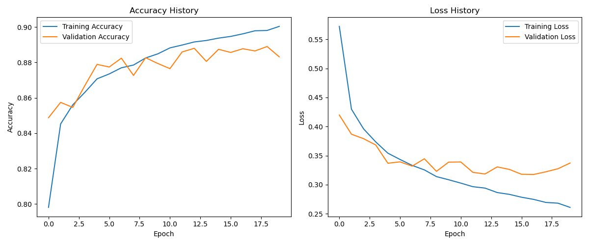

# Fashion Classifier Using TensorFlow y Keras

This project uses a sequential neural network, built with Keras and TensorFlow, to classify 10 different types of clothing from the Fashion MNIST dataset. The model achieves an **accuracy of approximately 88%** on the test dataset.

### Result Visualization


*Graphs showing the evolution of accuracy and loss during training.*

---
### Technologies Used
- Python 3.x
- TensorFlow / Keras
- NumPy
- Matplotlib

---
### Installation

To run this project, clone the repository and create a virtual environment. 

```bash
# Clone the repo
git clone [https://github.com/tu-usuario/fashion-classifier.git](https://github.com/tu-usuario/fashion-classifier.git)
cd fashion-classifier

# Create a virtual environment and install dependencies
python -m venv venv
source venv/bin/activate  # in Windows: venv\Scripts\activate
pip install -r requirements.txt
```

---
### Usage

To train model execute the `train.py` script from the `src` folder.

```bash
python src/train.py
```

The script will execute the following steps:
- **Data Loading and Preprocessing**: Loads and preprocesses the Fashion MNIST dataset.
- **Model Building**: Constructs and compiles the neural network architecture.
- **Training**: Trains the model for 20 epochs.
- **Evaluation**: Evaluates the model's performance on the test set.
- **Saving**: Saves the trained model to the `models/` folder and performance graphs to `images/`.

### Model Architecture 

The model is a sequential neural network with the following layers:
- **Flattening Layer:** Flattens the 28x28 images into a 784-pixel vector.
- **Hidden Dense Layer:** 128 neurons with ReLU activation.
- **Dropout Layer:** 0.3 rate for regularization and overfitting prevention.
- **Output Dense Layer:** 10 neurons (one per class) with Softmax activation for classification.
